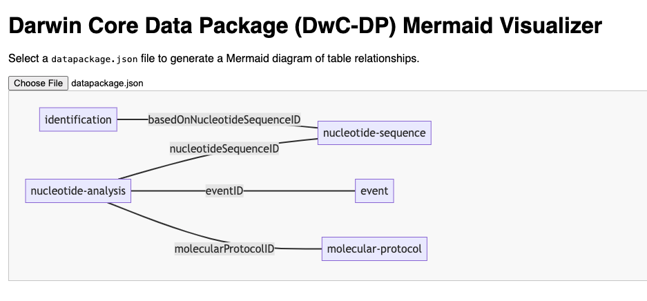

# Darwin Core Data Package Mermaid Visualizer

*co-authored with ChatGPT.*

# 🧬 DwC-DP Mermaid Visualizer (Web Version)

This lightweight, browser-based tool lets you **visualize table relationships in any Darwin Core Data Package (DwC-DP)** using [Mermaid.js](https://mermaid-js.github.io/).

## 🌐 Live Demo

👉 [Use the tool on GitHub Pages](https://yourusername.github.io/dwc-dp-mermaid-webapp)

*(Replace the URL above with your actual GitHub Pages link)*

---

## 📦 What It Does

- Accepts a `datapackage.json` file from any valid DwC-DP
- Parses tables and their `foreignKeys`
- Constructs a Mermaid `flowchart LR` diagram
- Renders it instantly in the browser — **no server, no build, no install**

---

## 🚀 How to Use

1. Visit the [GitHub Pages site](https://yourusername.github.io/dwc-dp-mermaid-webapp)
2. Click **“Choose File”** and select your `datapackage.json`
3. View the interactive diagram of table relationships!

## 💡 Example Input

Upload a DwC-DP `datapackage.json` file. [Example file](example/datapackage.json).
